# 复刻米哈游官网

## 1. 基本信息

- 作者: GMCY
- 系列: 复刻系列
- 网站: [米哈游官网-复刻的](https://gmcy2020.github.io/Reprint-MiHoYo-Web/)
- 仓库: [GitHub](https://github.com/GMCY2020/Reprint-MiHoYo-Web) | [Gitee](https://gitee.com/GMCY2020/Reprint-MiHoYo-Web)
- 话题(GitHub): [vue](https://github.com/topics/vue) \ [reprint](https://github.com/topics/reprint) \ [mihoyo](https://github.com/topics/mihoyo)
- 创建时间: 2023/07/03

## 2. 介绍

- 项目参考 [米哈游官网-国内](https://www.mihoyo.com) , 进行粗略的模仿
- 项目图片视频等资源来自米哈游官网, 仅编程学习用
- 米哈游官网复刻的样式并非最新, 项目的样式是项目开始创建时的样式, 后面看情况再考虑要不要改
- 基本信息中的网站, 国内访问GitHub网络问题. 可能有延迟, 图片未更新, 图片未加载等问题. 项目下载到本地应该不卡.
- 因为是按照2550X1440分辨率的显示屏来开发的. 当初未考虑适配问题, 所以可能会出现图片大小位置出错的情况. 使用同分辨率的屏幕应该正常.
- 能力有限, 无法做到米家那般丝滑
- 项目应该还存在许多问题(ノへ￣、)
- 个人学习自用

## 3. 环境

编辑器
- `VSCode`

框架
- `vue.js`

## 4. 使用

- 双击 `index.html` 即可打开

## 5. 效果图

首页
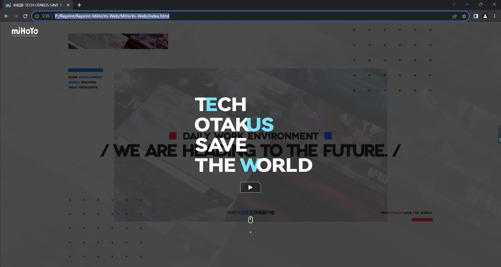
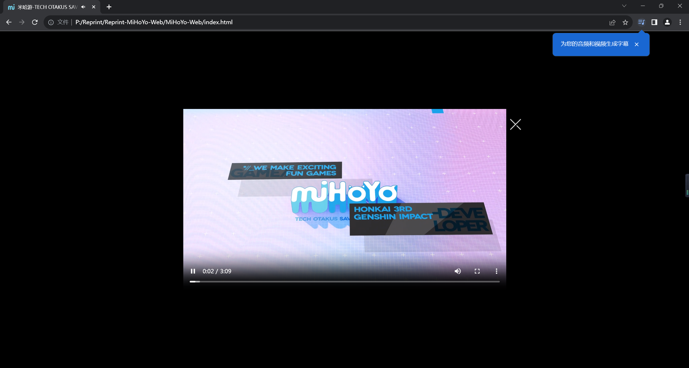

产品信息
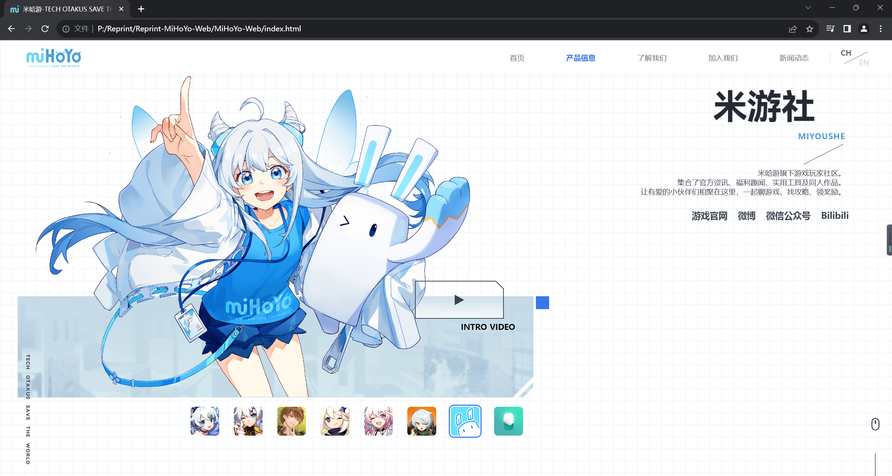
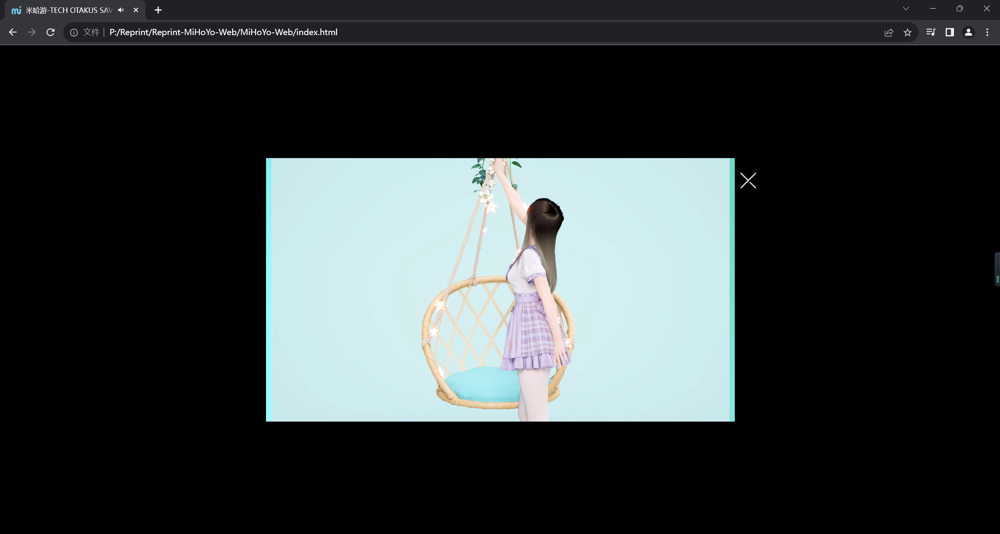

了解我们
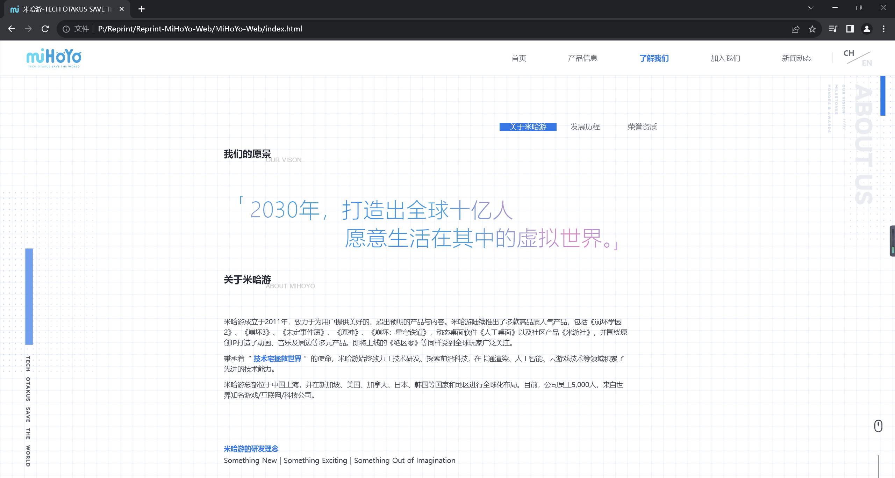
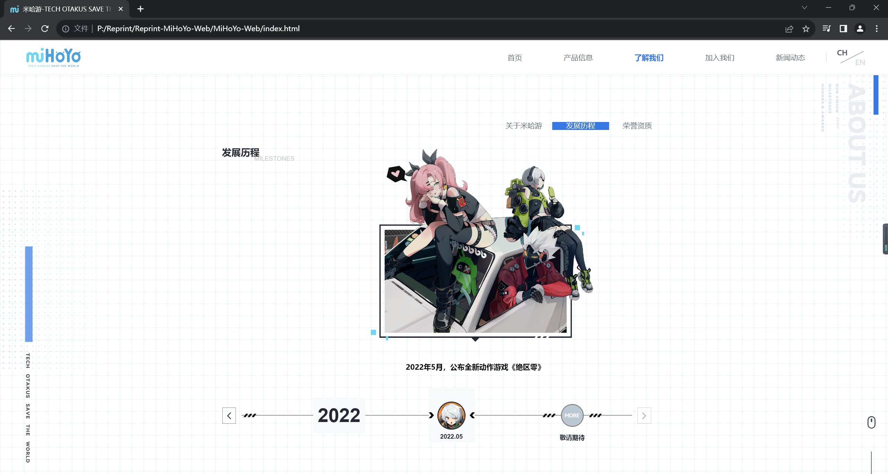
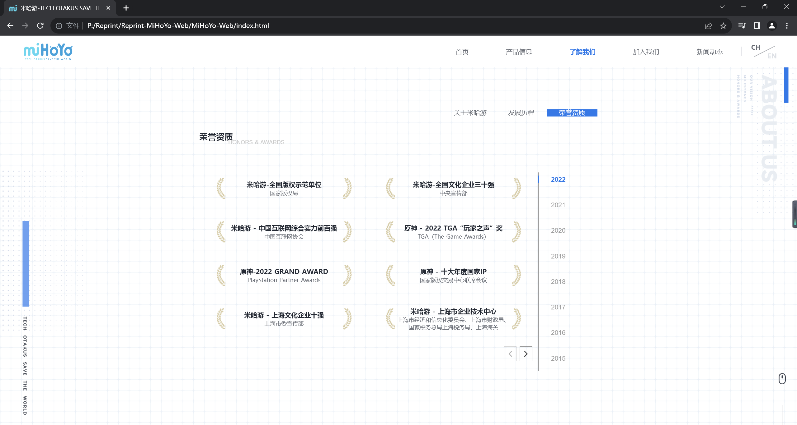

加入我们
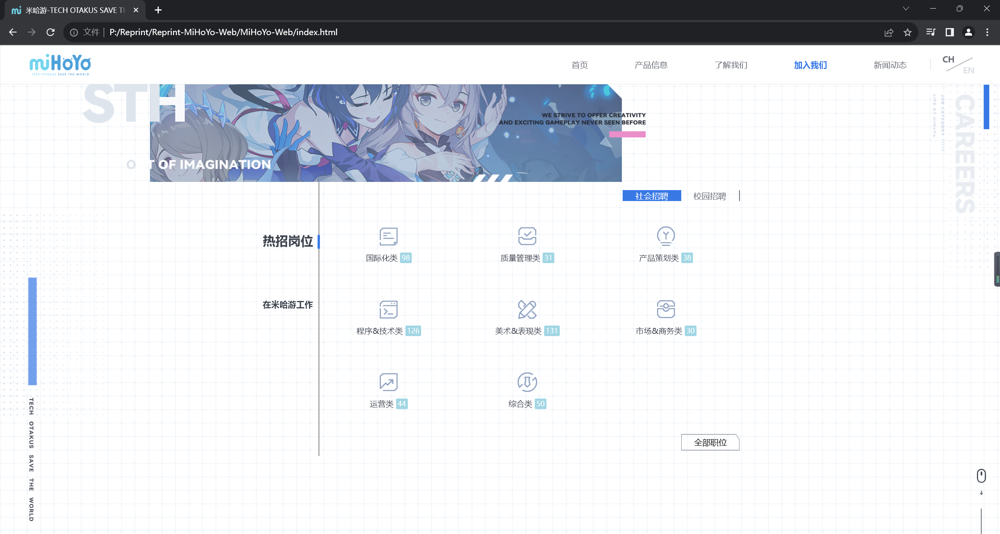
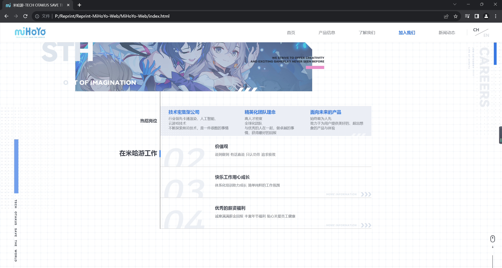

新闻动态
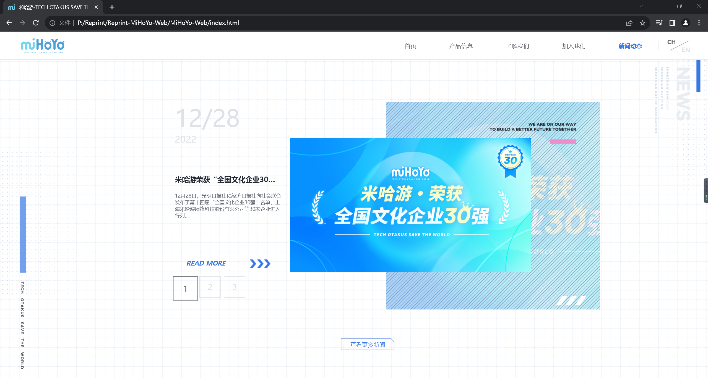
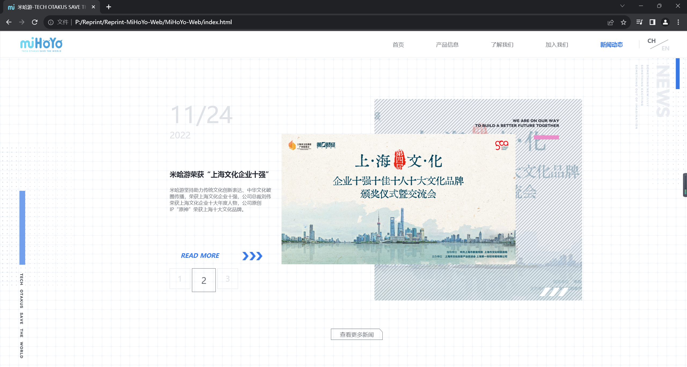

底部
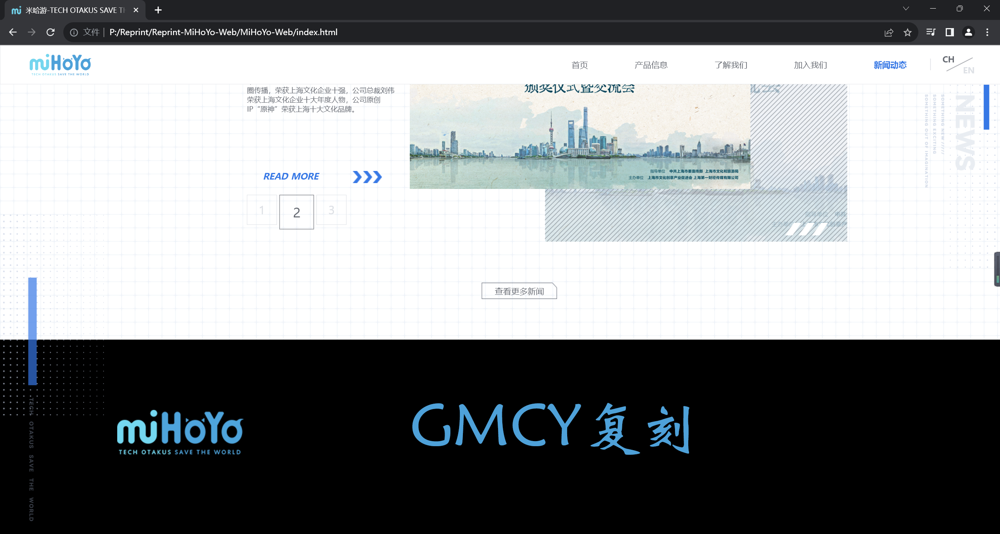
